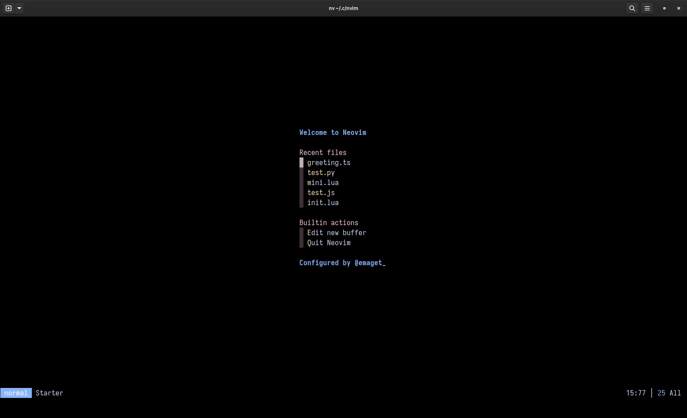

# My Personal Neovim Configuration



## NOTICE

This config is half-baked. There's always something in here that I want to improve upon. If you use it or any of its parts, please be aware of that first.
If you have any questions, comments, concerns, or suggestions for me, I would love if you shared them with me! Any help with this process is greatly appreciated!

That being said, here's a list of things that need improvement, followed by more information about the config:

## TODO:
    - [ ] research broken keymaps (can be found and tested in ../emaget/keymaps.lua)
    - [ ] Learn more about and null-ls and consider re-adding it
    - [ ] Set up Java stuff
    - [ ] Start creating and testing snippets to use.
    - [ ] Learn more about null-ls
    - [ ] HTML tag snippets are needed
    - [ ] I think I figured this out but I got some weird errors in a CSS file...need to investigate
    - [ ] I need to move this file to the README
    - [ ] Add arrow function snippets.
    - [ ] MarkdownPreview is not opening files....investigation needed!
    - [ ] Check recent Toggleterm changes
    - [ ] See if web-view is working again...

## *The short and sweet*
My goals for this config were pretty straightforward:

- I want it to be easy on my eyes. 
- I want it to be...ahem, "blazingly fast!"
- I want it to be sensible and understandable.
- I want it to be simple.
- I want it to spark joy.

I think I've accomplished those things here! If you decide to try it, I'd love to know what you think and what changes and 
recommendations you have for me to improve it!

## *The long and tangential*
I've tried a few different Neovim configurations, the first of which was my own copy-pasted, overcomplicated mess of a config.
Then, I tried to set up and work with several prebuilt configurations. My favorite of all of the available prebuilt configs is
[the Neovim from Scratch config](https://github.com/LunarVim/Neovim-from-scratch/tree/master/lua/user) created by [chris@machine](https://github.com/ChristianChiarulli). I used this for a while, but still found myself struggling with making
changes and updates to the config without slowing it down or breaking it completely. Sometimes, out of frustration, I would either
go back to VS C*de or spend hours to days working on an Emacs config (which I'm still working on). Eventually, I would go back to
that particular config and read about Lua and watch the Neovim from Scratch series on Youtube, and I learned quite a lot. One day,
I decided to try and write my own config. This is the result of that effort.

## *The config*

### Plugin Manager

- [Lazy.nvim](https://github.com/folke/lazy.nvim)

This config uses Lazy for plugin management. Lazy has great documentation, and you can move to it from any package manager. I've
tried my best to document all of the help I needed or used while setting this up. I think it could be helpful to people in the future,
including myself!

### The Plugins

#### *Colorschemes*

- [Catppuccin](https://github.com/catppuccin/nvim)

This is probably my favorite theme, like, *ever*. I prefer the Mocha variant, and I use color overrides to customize it (see [here](https://github.com/catppuccin/nvim#overwriting-colors). I will say,
in Neovim-QT, it seems to cause slower performance. On Linux, it works well. I've tried it in both ```gnome-terminal``` and [kitty](https://sw.kovidgoyal.net/kitty/)
without issue.

- [Moonfly](https://github.com/bluz71/vim-moonfly-colors)

This theme is a bit faster for me in Neovim-QT (I'm on Windows for now), so I would suggest using it if you're on Windows

#### *Statusline*

- [Linefly](https://github.com/bluz71/nvim-linefly)

I was actually looking for something like [express_line.nvim](https://github.com/tjdevries/express_line.nvim), or to create my own, but since the developer of the theme I'm using also created this,
I thought I'd give it a try. It also comew with out-of-the-box support for Catppuccin. It's fast and simple and useful. I have yet to experiment with customization options. The purpose of this config
is simplicity. That being said, I didn't want to spend a bunch of time configuring the statusline. Eventually, I think the best thing would be to write my own either as a plugin or directly in the config,
but linefly works well enough for me for the time being.

#### *Greeter*

- [Mini.starter](https://github.com/echasnovski/mini.starter)

In Neovim-QT, the default splash screen doesn't show up on start. As far as I've researched, this is a common issue. I've only ever experienced it when using a statusline plugin, hence my desire to write my own.
So, I grabbed a greeter to fill that space until I can figure out what is causing it for certain.

#### *Help and file navigation*

- [Telescope](https://github.com/nvim-telescope/telescope.nvim)

The most helpful place to learn about Telescope is its documentation. TJ DeVries does an excellent job of explaining its uses in the Bash 2 Basics series on YouTube.

- [Telescope File Browser](https://github.com/nvim-telescope/telescope-file-browser.nvim)

Another very useful plugin. Telescope has completely eliminated my need for a file tree viewer at this point (I mean, this provides
one, but I'm just saying I don't need *another* plugin just for viewing project structure). Having this as an extension of a plugin I already love is just...incredible.

- [Harpoon](https://github.com/ThePrimeagen/harpoon)

This is just freaking cool. Harpoon allows my brain to focus on the files I need and access them with a set of keybindings that make
sense to me. It's easy to set up and easy to use and incredibly powerful. 

- [Luaref](https://github.com/milisims/nvim-luaref)

This is great for referencing Lua without leaving my editor. Again, please check the documentation to learn how it works.

#### *Editing text*

- [vim-surround](https://github.com/tpope/vim-surround)

In every config I have used, I have added this plugin. It's one of the main reasons I stick to using Neovim.

- [Undo Tree](https://github.com/mbbill/undotree)

I have been looking for something like this for a long time. I love this plugin! I learned how to set it up from The Primeagen's 0 to LSP video.

- [Which Key](https://github.com/folke/which-key.nvim)

This is something I got used to using while learning Doom Emacs. This Neovim plugin works just as well.

#### *Code specific plugins*

- [Plenary](https://github.com/nvim-lua/plenary.nvim)

This one is required by a few plugins used in this config, so I want to make sure I mention it here.

- [Treesitter](https://github.com/nvim-treesitter/nvim-treesitter)

I think this is self-explanatory. If not, the docs are pretty helpful. There are also several YouTube videos on it.

- [Lsp-Config]()
LSP Zero is great if you already know what you're doing and want to reduce the amount of config code you're writing. I wanted to try to set up LSP
the long way, so I swapped it out for ```lsp-ocnfig```. Part of this requires setting up ```nvim-cmp``` which I still have a lot to learn about.

- [Web Tools](https://github.com/ray-x/web-tools.nvim)

This is a very useful plugin for developing websites, like Live Server in VS C*de.

- [Todo Highlight](https://github.com/folke/todo-comments.nvim)

I like the way the highlighting is done, here!

- [Toggleterm](https://github.com/akinsho/toggleterm.nvim)

The chris@machine setup introduced me to this plugin and it is probably the one I use the most!

- [Code Runner](https://github.com/CRAG666/code_runner.nvim)

This plugin allows me to run code using keyboard shortcuts. 
It speeds up my workflow ever so slightly because I no longer need to remember what commands to run when I want to run a file

#### *Git-related*

- [Git Signs](https://github.com/lewis6991/gitsigns.nvim)

I like to be able to see what's new or changed, without it being messy or using icons or some other kind of visual clutter.
