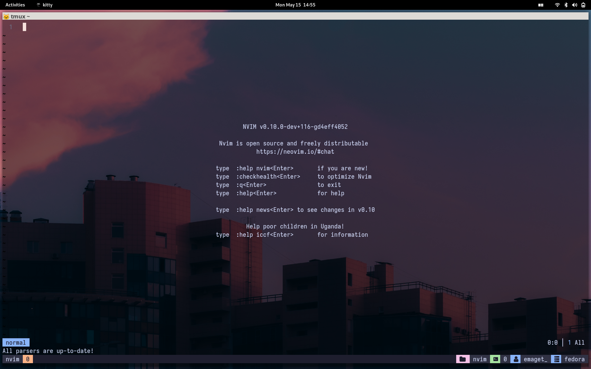

# My Personal Neovim Configuration

## NOTICE

This config is half-baked. There's always something in here that I want to improve upon. If you use it or any of its parts, please be aware of that first.
If you have any questions, comments, concerns, or suggestions for me, I would love if you shared them with me! Any help with this process is greatly appreciated!

That being said, here's a list of things that need improvement, followed by more information about the config:

## TODO:
    - [ ] Start creating and testing snippets to use.
    - [ ] Update README with new plugins and maybe a screenshot

If you want to see the plugins, head over to [plugins](./lua/plugins)
If you want to see the settings, check out [options](./lua/dorraj/options)
